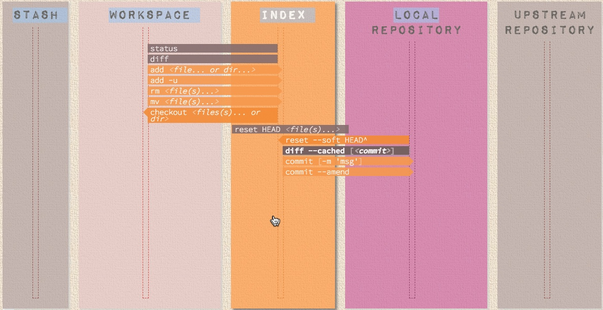

<hr>
<p align="center">
    
</p>
<hr>

<hr>

Git Cheat Sheet 
===============
### Index
* [Set Up](#setup)
* [Configuration Files](#configuration-files)
* [Create](#create)
* [Local Changes](#local-changes)
* [Search](#search)
* [Commit History](#commit-history)
* [Branches & Tags](#branches-and-tags)
* [Update & Publish](#update-and-publish)
* [Merge & Rebase](#merge-and-rebase)
* [Undo](#undo)
* [Alias](#alias)
* [Visual Cheat Sheet](#visual-cheat-sheet)


<hr>

## Setup

##### Show current configuration:
```shell
 git config --list
```
##### Show repository configuration:
```shell
 git config --local --list
```

##### Show global configuration:
```shell
 git config --global --list
```

##### Show system configuration:
```shell
 git config --system --list
```

##### Set a name that is identifiable for credit when review version history:
```shell
 git config --global user.name “[firstname lastname]”
```

##### Set an email address that will be associated with each history marker:
```shell
 git config --global user.email “[valid-email]”
```

##### Get Author details
```shell
 git config user.name
 git config user.email
```

##### Reset Author
```shell
git commit --amend --reset-author
```

##### Set automatic command line coloring for Git for easy reviewing:
```shell
 git config --global color.ui auto
```

##### Set global editor for commit
* **For Windows**
_Visual Studio Code as Git Global Editor_
```shell
git config --global core.editor "'C:\Program Files (x86)\Microsoft VS Code\code.exe' -w"

 or

git config --global core.editor "'C:/Program\ Files/Microsoft\ VS\ Code/Code.exe'-n -w"
```
NOTE: Make sure you have the path right

* **For MAC**
_Visual Studio Code as Git Global Editor_

```shell
git config --global core.editor "code --wait"
```

##### Set global Diff tool
_Visual Studio Code as Git Global Diff tool_
- Add the below code in git config file. Please see below where to find the config files.
```shell
[diff]
    tool = default-difftool
[difftool "default-difftool"]
    cmd = code --wait --diff $LOCAL $REMOTE
```
_IntelliJ IDEA as Git Global Diff tool_
* For Windows
     - Add the below code in git config file. Please see below where to find the config files.
```shell
[diff]
    tool = intellij
[difftool "intellij"]
    cmd = cmd.exe //c "\"C:/Program Files (x86)/IntelliJ IDEA Community Edition /bin/idea.bat\" diff \"$LOCAL\" \"$REMOTE\""
```
_Note : Make sure you have the path right_
* For MAC
    - Add the below code in git config file. Please see below where to find the config files.
```shell
[diff]
    tool = intellij
[difftool "intellij"]
    cmd = /Applications/IntelliJ\\ IDEA.app/Contents/MacOS/idea diff $(cd $(dirname "$LOCAL") && pwd)/$(basename "$LOCAL") $(cd $(dirname "$REMOTE") && pwd)/$(basename "$REMOTE")
```


##### Set global Merge tool
_IntelliJ IDEA as Git Global Diff tool_
* For Windows
     - Add the below code in git config file. Please see below where to find the config files.
```shell
[merge]
    tool = intellij
[mergetool "intellij"]
    cmd = cmd.exe //c "\"C:/Program Files (x86)/IntelliJ IDEA Community Edition /bin/idea.bat\" merge \"$LOCAL\" \"$REMOTE\" \"$BASE\" \"$MERGED\""
    trustExitCode = true
```
* For MAC
    - Add the below code in git config file. Please see below where to find the config files.
```shell
[merge]
    tool = intellij
[mergetool "intellij"]
    cmd = /Applications/IntelliJ\\ IDEA.app/Contents/MacOS/idea merge $(cd $(dirname "$LOCAL") && pwd)/$(basename "$LOCAL") $(cd $(dirname "$REMOTE") && pwd)/$(basename "$REMOTE") $(cd $(dirname "$BASE") && pwd)/$(basename "$BASE") $(cd $(dirname "$MERGED") && pwd)/$(basename "$MERGED")
    trustExitCode = true
```
<hr>

## Configuration Files

##### Repository specific configuration file [--local]:
```shell
<repo>/.git/config
```

##### User-specific configuration file [--global]:
```shell
~/.gitconfig
```

##### System-wide configuration file [--system]:
```shell
/etc/gitconfig
```

<hr>

## Create

##### Clone an existing repository:

There are two ways:

Via SSH

```shell
 git clone ssh://user@domain.com/repo.git
```

Via HTTP

```shell
 git clone http://domain.com/user/repo.git
```

##### Create a new local repository:
```shell
 git init
```

<hr>

## Local Changes

##### Changes in working directory:
```shell
 git status
```

##### Changes to tracked files:
```shell
 git diff
```
##### diff with changed works highlighted:
```shell
git diff --color-words
```

##### Add all current changes to the next commit:
```shell
 git add .
```

##### Add some changes in &lt;file&gt; to the next commit:
```shell
 git add -p <file>
```

##### Commit all local changes in tracked files:
```shell
 git commit -a
```

##### Commit previously staged changes:
```shell
 git commit
```

##### Commit with message:
```shell
 git commit -m 'message here'
```

##### Commit skipping the staging area and adding message:
```shell
 git commit -am 'message here'
```
##### to uncommit the changes from repo- to undo commit (very last commit):
```shell
git commit --amend -m "message"
```
##### Commit to some previous date:
```shell
 git commit --date="`date --date='n day ago'`" -am "<Commit Message Here>"
```

##### Change last commit:<br>
<em><sub>Don't amend published commits!</sub></em>

```shell
 git commit -a --amend
```

##### Amend with last commit but use the previous commit log message
<em><sub>Don't amend published commits!</sub></em>

```shell
 git commit --amend --no-edit
```

##### Change committer date of last commit:
```
GIT_COMMITTER_DATE="date" git commit --amend
```

##### Change Author date of last commit:
```shell
 git commit --amend --date="date"
```

##### Move uncommitted changes from current branch to some other branch:<br>
```shell
 git stash
 git checkout branch2
 git stash pop
```

##### Restore stashed changes back to current branch:
```shell
 git stash apply
```

#### Restore particular stash back to current branch:
- *{stash_number}* can be obtained from `git stash list`

```shell
 git stash apply stash@{stash_number}
```

##### Remove the last set of stashed changes:
```shell
 git stash drop
```
##### All Stash Commands
```shell
#to stash the changes 
git stash save "$message" #this will stash all the files with changes

git stash list # to list the files in the stash
git stash show $stash_name # this will show diff of the file
git stash show -p $stash_name # this will show extensive diff of the file

# this is pull stash to a branch
git stash pop $stash_name # will remove stash when pull
git stash apply $stash_name # will keep a copy in the stash
git stash drop $stash_name # will drop the stash
git stash clear # will clear the whole stash
```

<hr>

## Search

##### A text search on all files in the directory:
```shell
 git grep "Hello"
```

##### In any version of a text search:
```shell
 git grep "Hello" v2.5
```

<hr>

## Commit History

##### Show all commits, starting with newest (it'll show the hash, author information, date of commit and title of the commit):
```shell
 git log
```
_Better Vesion of git log :_
```shell
git log --oneline --graph --decorate --all
```

##### Show all the commits(it'll show just the commit hash and the commit message):
```shell
 git log --oneline
```

##### Show all commits of a specific user:
```shell
 git log --author="username"
```

##### Show changes over time for a specific file:
```shell
 git log -p <file>
```

##### Display commits that are present only in remote/branch in right side
```shell
 git log --oneline <origin/master>..<remote/master> --left-right
```

##### Who changed, what and when in &lt;file&gt;:
```shell
 git blame <file>
```

##### Show Reference log:
```shell
 git reflog show
```

##### Delete Reference log:
```shell
 git reflog delete
```
<hr>

## Branches and Tags

##### List all local branches:
```shell
 git branch
```

#### List local/remote branches
```shell
 git branch -a
```

##### List all remote branches:
```shell
 git branch -r
```

##### Switch HEAD branch:
```shell
 git checkout <branch>
```

##### Checkout single file from different branch
```shell
 git checkout <branch> -- <filename>
```

##### Create and switch new branch:
```shell
 git checkout -b <branch>
```

#### Checkout and create a new branch from existing commit
```shell
 git checkout <commit-hash> -b <new_branch_name>
```

##### Create a new branch based on your current HEAD:
```shell
 git branch <new-branch>
```

##### Create a new tracking branch based on a remote branch:
```shell
 git branch --track <new-branch> <remote-branch>
```

##### Delete a local branch:
```shell
 git branch -d <branch>
```

##### Rename current branch to new branch name
```shell
 git branch -m <new_branch_name>
```

##### Force delete a local branch:
<em><sub>You will lose unmerged changes!</sub></em>

```shell
 git branch -D <branch>
```

##### Mark the current commit with a tag:
```shell
 git tag <tag-name>
```

##### Mark the current commit with a tag that includes a message:
```shell
 git tag -a <tag-name>
```
<hr>

## Update and Publish

##### List all current configured remotes:
```shell
 git remote -v
```

##### Show information about a remote:
```shell
 git remote show <remote>
```

##### Add new remote repository, named &lt;remote&gt;:
```shell
 git remote add <remote> <url>
```

##### Download all changes from &lt;remote&gt;, but don't integrate into HEAD:
```shell
 git fetch <remote>
```

_Fetch Golden Rules_
*   - Always fetch before you start work
    - Always fetch before you push
    - Always fetch often
    - Always fetch before merge
- **git pull = git fetch + git merge**

##### Download changes and directly merge/integrate into HEAD:
```shell
 git remote pull <remote> <url>
```

##### Get all changes from HEAD to local repository:
```shell
 git pull origin master
```

##### Get all changes from HEAD to local repository without a merge:
```shell
 git pull --rebase <remote> <branch>
```

##### Publish local changes on a remote:
```shell
 git push remote <remote> <branch>
```

##### Delete a branch on the remote:
```shell
 git push <remote> --delete <branch>
```

##### Publish your tags:
```shell
 git push --tags
```
<hr>


##### Use your configured merge tool to solve conflicts:
```shell
 git mergetool
```

## Merge and Rebase

##### Merge branch into your current HEAD:
```shell
 git merge <branch>
```

##### Rebase your current HEAD onto &lt;branch&gt;:<br>
<em><sub>Don't rebase published commit!</sub></em>

```shell
 git rebase <branch>
```

##### Abort a rebase:
```shell
 git rebase --abort
```

##### Continue a rebase after resolving conflicts:
```shell
 git rebase --continue
```

##### Use your editor to manually solve conflicts and (after resolving) mark file as resolved:
```shell
 git add <resolved-file>
```

```shell
 git rm <resolved-file>
```

##### Remove file from the staging index
```shell
git rm --cached <File_name>
```

##### Squashing commits:
```shell
 git rebase -i <commit-just-before-first>
```

Now replace this,

```
pick <commit_id>
pick <commit_id2>
pick <commit_id3>
```

to this,

```
pick <commit_id>
squash <commit_id2>
squash <commit_id3>
```
<hr>

## Undo

##### Discard all local changes in your working directory:
```shell
 git reset --hard HEAD
```

##### Get all the files out of the staging area(i.e. undo the last `git add`):
```shell
 git reset HEAD
```

##### Discard local changes in a specific file:
```shell
 git checkout HEAD <file>
```

##### Revert a commit (by producing a new commit with contrary changes):
```shell
 git revert <commit>
```

##### Reset your HEAD pointer to a previous commit and discard all changes since then:
```shell
 git reset --hard <commit>
```

##### Reset your HEAD pointer to a remote branch current state.
```shell
 git reset --hard <remote/branch> e.g., upstream/master, origin/my-feature
```

##### Reset your HEAD pointer to a previous commit and preserve all changes as unstaged changes:
```shell
 git reset <commit>
```

##### Reset your HEAD pointer to a previous commit and preserve uncommitted local changes:
```shell
 git reset --keep <commit>
```

##### Remove files that were accidentally committed before they were added to .gitignore
```shell 
 git rm -r --cached .
 git add .
 git commit -m "remove xyz file"
```
<hr>

## Alias

```shell
git config --global alias.st status #aliasing status as st
git config --global alias.co checkout
git config --global alias.ci commit
git config --global alias.br branch
git config --global alias.dfs "diff --staged" #since it has space in it we padded with double quotes
git config --global alias.logg "log -graph --decorate --oneline --abbrev-commit --all"
```

<hr>

## Visual Cheat Sheet
> Source: https://ndpsoftware.com/git-cheatsheet.html
##### UPSTEAM REPO (GITHUB)
<p align="center">
    
</p>

##### LOCAL REPO
<p align="center">
    
</p>

##### STAGING INDEX
<p align="center">
    
</p>

##### WORKSPACE
<p align="center">
    
</p>

##### STASH
<p align="center">
    
</p>